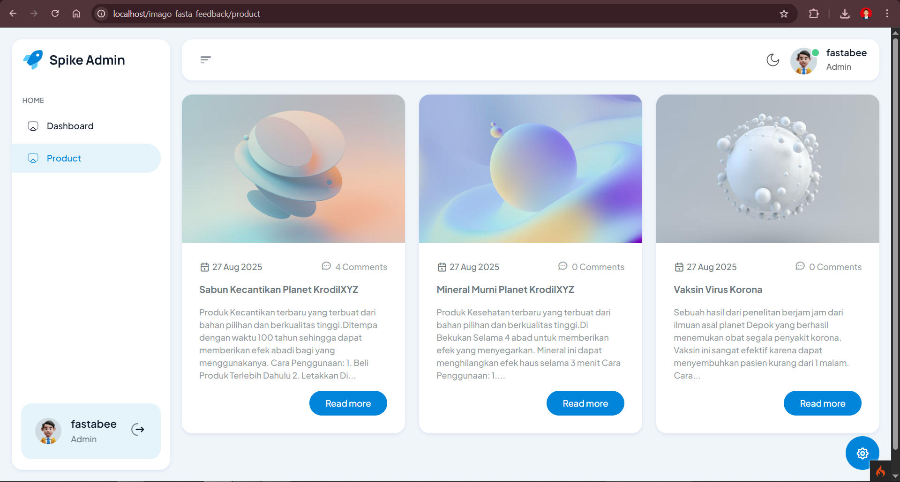
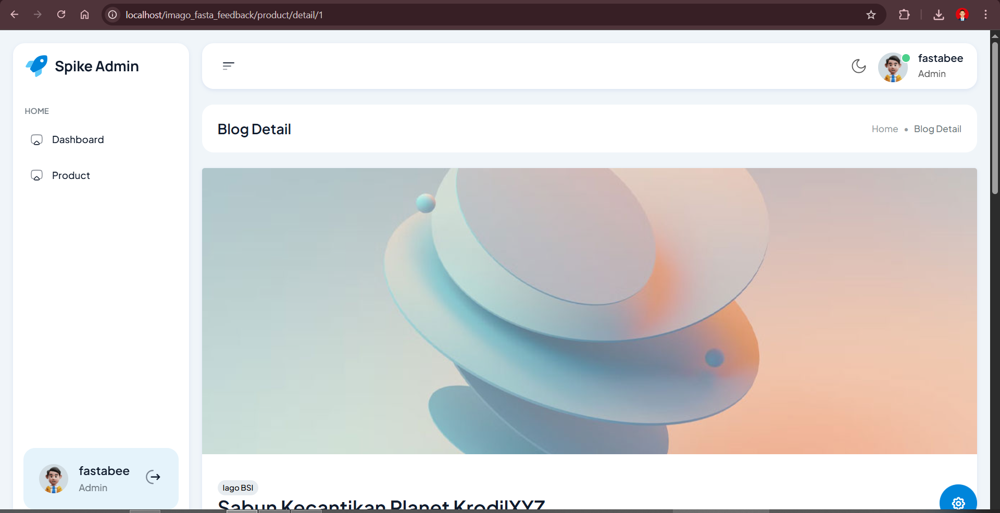
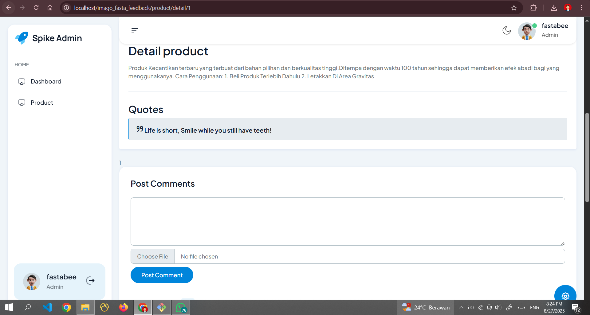
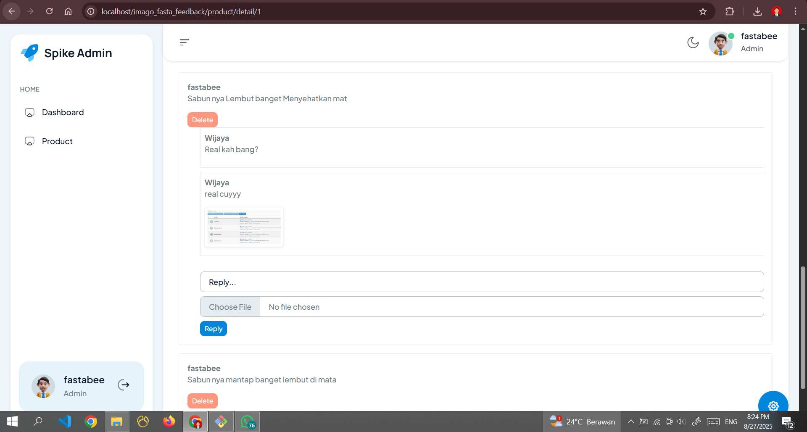

Panduan Instalasi

clone project ke xampp/htdocs

uploud database dan sesuiakan pengaturanya

sesuaikan nama folder dan nama localhost/(nama folder) di app/config/app.php

jalankan localhost/nama_folder

contohnya : localhost/imago_fasta_tes1

enkripsi menggunakan bycrypt -> untuk login pertama gunakan

email : fastabee@gmail.com

pw : fastabee@gmail.com

email2: Wijaya@gmail.com
pw : Wijaya

# Dokumentasi

## Tampilan Aplikasi

### Halaman 1

Tambahan ss  

### Halaman 2

Tambahan ss  

### Halaman 3

Tambahan ss  

### Halaman 4

Tambahan ss  

